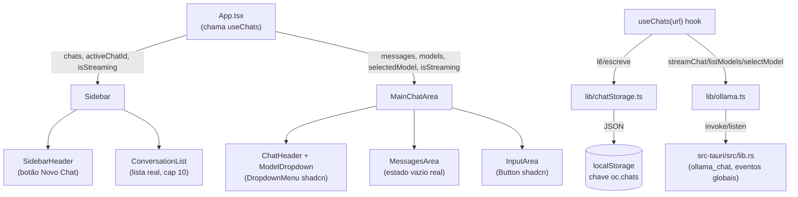

# Histórico Real de Chats + shadcn/ui Design

**Spec**: `.specs/features/chat-history/spec.md`
**Status**: Draft

---

## Architecture Overview

Um único hook `useChats(url)` substitui `useOllamaChat` e vira a fonte única de estado: lista de chats persistidos, chat ativo, streaming e modelos. `App.tsx` o chama uma vez e passa dados/handlers via props (árvore rasa, 1-2 níveis — sem Context, sem store externo, conforme decisão confirmada). A persistência é uma camada pura (`lib/chatStorage.ts`) sobre `localStorage`, sem tocar o backend Rust.



---

## Code Reuse Analysis

### Existing Components to Leverage

| Component | Location | How to Use |
| --- | --- | --- |
| `streamChat`, `listModels`, `selectModel`, `ChatMessage`, `OllamaModel` | `src/lib/ollama.ts` | Reaproveitados sem alteração dentro do novo `useChats` |
| `cn()` | `src/lib/utils.ts` | Já existe no formato exato que o shadcn CLI espera (`clsx` + `tailwind-merge`) — shadcn init vai detectar e reusar, não recriar |
| Tokens de tema (`--color-bg-sidebar`, `--color-accent-blue`, `--radius-*`, etc.) | `src/index.css` | Os CSS vars que o shadcn injeta (`--primary`, `--background`, `--radius`, ...) serão remapeados para apontar para esses tokens existentes, preservando o visual atual |
| `MessagesArea` (branch de lista vazia) | `src/components/Chat/MessagesArea.tsx` | Já existe a checagem `messages.length === 0`; só troca o texto — cobre as duas ACs de estado vazio (sem chat ativo E chat ativo sem mensagens) porque em ambos os casos `messages` chega vazio |
| Estrutura de pastas `Sidebar/` e `Chat/` | `src/components/` | Mantida; só os arquivos internos mudam de fonte de dados (mock → hook) |

### Integration Points

| System | Integration Method |
| --- | --- |
| `localStorage` | Nova chave `oc.chats` (array JSON de `StoredChat`), lida/escrita só por `lib/chatStorage.ts` — mesmo padrão já usado para `ollamaUrl` em `App.tsx` |
| Backend Tauri (`ollama_chat`) | Nenhuma mudança — segue emitindo `ollama-chunk`/`ollama-done` globais; o hook garante que só há 1 chat "recebendo" esses eventos por vez (troca bloqueada durante streaming) |
| shadcn/ui CLI | `npx shadcn@latest init` gera `components.json` + `src/components/ui/*`; consome o alias `@/*` novo em `tsconfig.json`/`vite.config.ts` |

---

## Components

### `src/lib/chatStorage.ts` (novo)

- **Purpose**: Camada pura de persistência de chats em `localStorage`, sem estado React.
- **Location**: `src/lib/chatStorage.ts`
- **Interfaces**:
  - `loadChats(): StoredChat[]` — lê `oc.chats`; JSON inválido/corrompido ou não-array retorna `[]` (edge case do spec).
  - `persistChats(chats: StoredChat[]): void` — `JSON.stringify` + `localStorage.setItem`.
  - `deriveTitle(firstMessage: string): string` — trim + corta em 40 chars, sufixo `"…"` se cortou.
  - `MAX_VISIBLE_CHATS = 10` (constante exportada).
- **Dependencies**: nenhuma (só `localStorage` global).
- **Reuses**: nada preexistente; é a peça nova de persistência.

### `src/lib/time.ts` (novo)

- **Purpose**: Formatar `updatedAt` (epoch ms) como rótulo relativo em pt-BR para a sidebar (substitui o campo `time` mockado).
- **Location**: `src/lib/time.ts`
- **Interfaces**:
  - `formatRelativeTime(ms: number): string` → `"agora"`, `"Xm atrás"`, `"Xh atrás"`, `"Ontem"`, `"Xd atrás"`.
- **Dependencies**: nenhuma.
- **Reuses**: nenhum código existente (não havia util de tempo).

### `src/hooks/useChats.ts` (novo, substitui `useOllamaChat.ts`)

- **Purpose**: Fonte única de estado de múltiplos chats — lista, ativo, streaming, modelos — e orquestra persistência + streaming do Ollama.
- **Location**: `src/hooks/useChats.ts`
- **Interfaces**:
  - `useChats(url: string): { chats: StoredChat[] (top 10, ordenado por updatedAt desc), activeChatId: string | null, messages: ChatMessage[], models: OllamaModel[], selectedModel: string, isStreaming: boolean, error: string | null, startNewChat(): void, selectChat(id: string): void, setSelectedModel(model: string): void, sendMessage(content: string): Promise<void> }`
- **Dependencies**: `lib/ollama.ts` (streaming/modelos), `lib/chatStorage.ts` (persistência).
- **Reuses**: a lógica de streaming (`streamingIndexRef`, atualização incremental de `content` por chunk) migrada quase 1:1 de `useOllamaChat.ts`, agora escrevendo no chat certo dentro do array `chats` em vez de um array solto.
- **Regras chave** (rastreiam os ACs do spec):
  - `activeChatId === null` ⇒ estado de rascunho: `messages = []`, `selectedModel = draftModel` (modelo default = primeiro da lista carregada). Nada é persistido (CHAT-04/CHAT-05).
  - `startNewChat()` / `selectChat(id)` são no-op se `isStreaming === true` (CHAT-06).
  - `sendMessage(content)` com `activeChatId === null`: cria `StoredChat` novo (`id` via `crypto.randomUUID()`, `title = deriveTitle(content)`, `createdAt = updatedAt = Date.now()`, `model = draftModel`, `messages = [{role:"user", content}]`), persiste imediatamente, define como ativo — só então inicia o streaming da resposta (CHAT-04/05).
  - `sendMessage(content)` com chat existente ativo: adiciona a mensagem do usuário ao chat, atualiza `updatedAt`, persiste; adiciona placeholder de assistente vazio; stream atualiza o `content` daquele chat via `setChats` funcional; ao final (`finally`), persiste de novo com o conteúdo final (CHAT-01 AC5).

### `src/App.tsx` (modificado)

- **Purpose**: Orquestra `useChats` e distribui props para `Sidebar` e `MainChatArea`.
- **Location**: `src/App.tsx`
- **Interfaces**: sem mudança de assinatura pública (continua um componente de página).
- **Dependencies**: `useChats`.
- **Reuses**: fluxo existente de `ollamaUrl`/`SetupScreen` inalterado.

### `src/components/Sidebar/Sidebar.tsx`, `SidebarHeader.tsx`, `ConversationList.tsx` (modificados)

- **Purpose**: Exibir chats reais, botão de novo chat funcional, bloqueio durante streaming.
- **Interfaces**:
  - `SidebarHeader({ onNewChat: () => void; disabled: boolean })`
  - `ConversationList({ chats: StoredChat[]; activeChatId: string | null; onSelect: (id: string) => void; disabled: boolean })`
- **Dependencies**: `lib/time.ts` (rótulo relativo), `components/ui/button.tsx`, `components/ui/scroll-area.tsx`.
- **Reuses**: layout/classes atuais (`bg-bg-hover`, `text-accent-blue-light`, ícone `MessageSquare`) preservados; só troca a fonte de dados de `mockData.conversations` para os props reais e envolve a lista com `ScrollArea` (CHAT-09).

### `src/components/Chat/MainChatArea.tsx`, `MessagesArea.tsx`, `InputArea.tsx`, `ChatHeader.tsx`, `ModelDropdown.tsx` (modificados)

- **Purpose**: Consumir estado via props (não mais `useOllamaChat` interno); estado vazio real; primitivos shadcn.
- **Interfaces**:
  - `MainChatArea({ messages, models, selectedModel, isStreaming, error, onSelectModel, onSend }: ...)` — recebe tudo de `App`, não chama hook.
  - `ChatHeader` + `ModelDropdown` fundidos em torno de `DropdownMenu`/`DropdownMenuTrigger`/`DropdownMenuContent`/`DropdownMenuItem` do shadcn — Radix passa a gerenciar o `open` internamente (remove o `useState(dropdownOpen)` que hoje vive em `MainChatArea`).
- **Dependencies**: `components/ui/{button,dropdown-menu,scroll-area}.tsx`.
- **Reuses**: `MessagesArea`'s branch vazio existente (só troca o texto para "Não existem mensagens a serem exibidas" — CHAT-07); `InputArea`'s lógica de `value`/`handleSend`/`handleKeyDown` inalterada, só o `<button>` de enviar vira `<Button>`.

### `src/components/Sidebar/ProfileSection.tsx` (modificado)

- **Purpose**: Usar `Avatar`/`AvatarFallback` do shadcn no lugar do círculo manual.
- **Dependencies**: `components/ui/avatar.tsx`.
- **Reuses**: `data/mockData.ts`'s `profile` export permanece (não é dado de chat, fora do escopo de mock a remover).

### `src/data/mockData.ts` (modificado)

- Remove o export `conversations` (fonte de mock de chats). Mantém `profile` (perfil do usuário, não é "histórico de chat").

### shadcn/ui — infraestrutura (novo)

- `components.json` (raiz do projeto): `style: "new-york"`, `rsc: false` (projeto Vite/SPA, sem RSC), `tsx: true`, `tailwind: { config: "", css: "src/index.css", baseColor: "neutral", cssVariables: true }` (Tailwind v4 CSS-first — `config` vazio confirmado na doc oficial), `aliases: { components: "@/components", ui: "@/components/ui", lib: "@/lib", hooks: "@/hooks", utils: "@/lib/utils" }`.
- `tsconfig.json`: adiciona `"baseUrl": "."` e `"paths": { "@/*": ["./src/*"] }`.
- `vite.config.ts`: adiciona `import path from "node:path"` e `resolve: { alias: { "@": path.resolve(__dirname, "./src") } }`.
- `package.json`: novo devDependency `@types/node` (necessário para `path`/`__dirname` tipados no `vite.config.ts`); shadcn CLI adiciona `class-variance-authority`, `@radix-ui/react-dropdown-menu`, `@radix-ui/react-avatar`, `@radix-ui/react-scroll-area`, `@radix-ui/react-slot` como dependencies dos componentes instalados.
- `src/components/ui/{button,dropdown-menu,scroll-area,avatar}.tsx`: gerados pelo CLI (`npx shadcn@latest add button dropdown-menu scroll-area avatar`), não escritos manualmente.
- `src/index.css`: o `init` injeta um bloco `:root { --background; --foreground; --primary; ...; --radius }` (+ um `.dark {...}` que este app não usa, pois não há alternância de tema). Passo manual pós-init: remapear os vars usados pelos componentes instalados (`--primary`, `--radius`, `--border`, `--background`, `--foreground`, `--accent`, `--ring`) para os tokens `--color-*`/`--radius-*` já existentes (ex.: `--primary: var(--color-accent-blue)`), e remover o bloco `.dark` não utilizado — preserva a paleta atual (decisão já travada no spec).

---

## Data Models

### `StoredChat`

```typescript
interface StoredChat {
  id: string;           // crypto.randomUUID()
  title: string;        // derivado da 1ª mensagem, fixo após criação
  createdAt: number;     // epoch ms
  updatedAt: number;     // epoch ms, atualizado a cada mensagem enviada
  model: string;         // modelo Ollama usado por este chat
  messages: ChatMessage[]; // reaproveita o tipo existente de lib/ollama.ts
}
```

**Relationships**: array de `StoredChat` é a única unidade persistida (`localStorage["oc.chats"]`). `ChatMessage` (`{ role: "user" | "assistant"; content: string }`) já existe em `lib/ollama.ts` e não muda.

**Sem migração**: não existe schema anterior de chats persistidos (`mockData.conversations` era só UI, nunca foi salvo) — não há dado legado para migrar.

---

## Error Handling Strategy

| Error Scenario | Handling | User Impact |
| --- | --- | --- |
| JSON corrompido/inválido em `localStorage["oc.chats"]` | `loadChats()` captura o erro do `JSON.parse` (ou valida `Array.isArray`) e retorna `[]` | App abre normalmente com sidebar vazia, sem crash (edge case do spec) |
| `localStorage.setItem` falha (quota excedida, modo privado) | `persistChats` deixa o erro propagar para o `catch` já existente no fluxo de `sendMessage`, populando `error` (mesmo padrão hoje usado para erros do Ollama) | Usuário vê a mesma faixa de erro vermelha que já existe em `MessagesArea` para erros do Ollama |
| Clique em "novo chat" ou em um chat da lista durante streaming | Ignorado no próprio hook (`if (isStreaming) return`) — nem chega a alterar estado | Nenhum feedback visual novo requerido pelo spec além do botão/itens ficarem com `disabled` (estilo já suportado pelos componentes `Button`) |
| `crypto.randomUUID()` indisponível (contexto não seguro) | Não coberto por fallback nesta rodada — ver Risks & Concerns | Risco muito baixo no ambiente Tauri (webview local); se ocorrer, `sendMessage` de um chat novo lançaria erro capturado pelo mesmo `catch` de streaming |

---

## Risks & Concerns

| Concern | Location (file:line) | Impact | Mitigation |
| --- | --- | --- | --- |
| Streaming do Ollama é global (eventos `ollama-chunk`/`ollama-done` não carregam id de chat) | `src-tauri/src/lib.rs:100-163` | Trocar de chat durante um streaming em andamento causaria chunks caindo no chat errado | Já mitigado por design: `useChats` bloqueia `startNewChat`/`selectChat` enquanto `isStreaming === true` (decisão confirmada do usuário, CHAT-06). Refatorar o backend para streaming por-chat fica fora de escopo. |
| Crescimento ilimitado de `localStorage["oc.chats"]` (sem poda) | `src/lib/chatStorage.ts` (novo) | Uso pesado e prolongado pode aproximar o limite de armazenamento do webview (~5-10MB) e deixar `JSON.parse`/`stringify` mais lentos a cada mensagem | Aceito como débito conhecido — o spec explicitamente não exige exclusão de dados antigos nesta rodada; poda/arquivamento fica para uma feature futura |
| Nenhum test runner configurado no projeto (`package.json` não tem vitest/jest/testing-library) | `package.json` | Não é possível gerar testes automatizados para as ACs sem antes introduzir infraestrutura de teste (fora do pedido original) | Verificação desta feature será manual/end-to-end via app rodando (dev server / Tauri), exercitando cada AC diretamente na UI — sinalizado aqui para não ser assumido silenciosamente como "testado" |
| `crypto.randomUUID()` depende de contexto seguro | `src/hooks/useChats.ts` (novo) | Em teoria falharia em contexto não-seguro; risco muito baixo no webview Tauri local | Nenhuma mitigação de fallback nesta rodada; se surgir em teste manual, trocar por um gerador simples (timestamp + random) é mudança pontual e barata |
| shadcn injeta paleta própria (`--primary`, `--background` em tons neutros) que conflita visualmente com o tema custom atual | `src/index.css` (pós-init) | Sem remapeamento, botões/dropdown/scrollbar/avatar shadcn ficariam com cores fora do tema (cinza padrão em vez de `accent-blue`/`bg-sidebar`) | Remapeamento manual dos CSS vars injetados para os tokens `--color-*` existentes, feito como parte da task de init (detalhado na seção Components acima) |

---

## Tech Decisions (only non-obvious ones)

| Decision | Choice | Rationale |
| --- | --- | --- |
| Estado ativo ao abrir o app | `activeChatId` sempre inicia `null` (rascunho), mesmo havendo chats salvos | Comportamento atual já abre em branco; AC3 do spec cobre esse caso literalmente; evita a ambiguidade de "qual chat abre automaticamente" sem contradizer nenhuma AC |
| Onde persistir | `localStorage`, chave `oc.chats`, sem tocar `src-tauri` | Já travado no spec (Assumptions) — sem plugin de store/SQL no Tauri hoje |
| Sort da lista | Calculado em memória (`useMemo` dentro de `useChats`, não mantido pré-ordenado no storage) | Mais simples, sem risco de ordem inconsistente entre leitura/escrita |
| `rsc: false` no `components.json` | Fixo, não Next.js | Projeto é Vite/SPA puro, sem React Server Components |
| Fusão de `ChatHeader` + `ModelDropdown` em torno de `DropdownMenu` | Radix assume o estado `open` internamente; remove `dropdownOpen` de `MainChatArea` | Simplifica `MainChatArea` e é o uso idiomático do componente shadcn (em vez de reimplementar toggle manual) |

> **Nenhuma decisão aqui estabelece um padrão de projeto além desta feature** — não há `.specs/STATE.md` ainda neste projeto, então nenhum `AD-NNN` prévio existia para conformar ou suplantar. Ao final desta feature, registrar `AD-001` para "camada de persistência local via `lib/*Storage.ts` + `localStorage`, sem backend" e `AD-002` para "shadcn/ui com CSS vars remapeadas para os tokens `--color-*` existentes em vez da paleta neutra padrão" — futuras features de persistência/UI devem conformar a esses dois padrões.

---

## Confirmed Approach

State management: hook único (`useChats`) + props (sem Context, sem store externo) — confirmado com o usuário.
